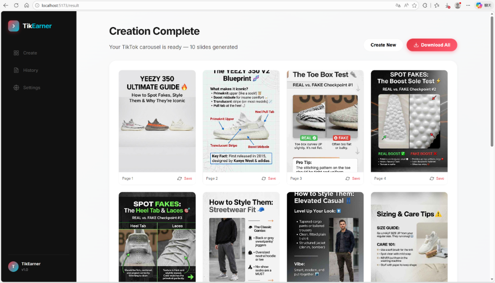
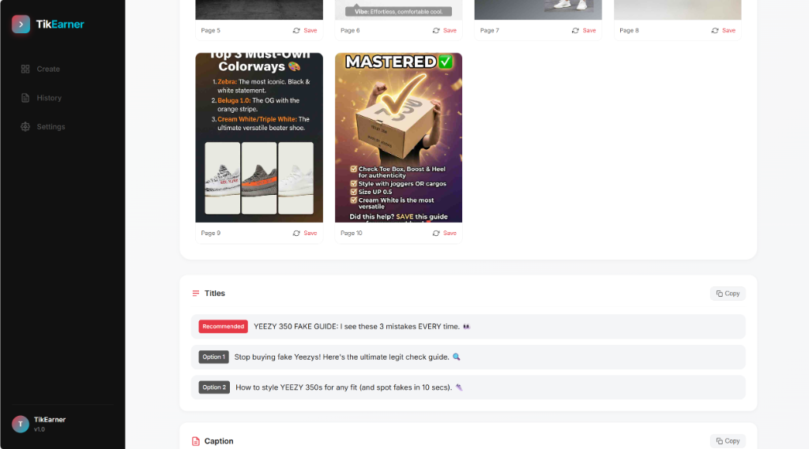
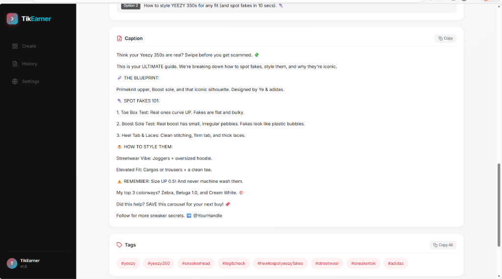

<div align="center">



# 🎯 TikEarner

**The AI-powered TikTok Carousel Generator that turns your ideas into viral content — in seconds.**

**用 AI 一键生成刷屏级 TikTok / 抖音 图文轮播。**

[](https://opensource.org/licenses/MIT)
[](https://vuejs.org/)
[](https://python.org/)
[](https://ai.google/)

</div>

---

## 🌐 Language / 语言版本

- [English](#-english)
- [中文](#-中文)

---

## 🇺🇸 English

### What is TikEarner?

TikEarner is a full-stack AI application that **automatically generates professional TikTok carousel posts** from a single topic or keyword. It orchestrates Large Language Models to write structured scripts and image generation APIs to create stunning, platform-ready visuals — all in one seamless workflow.

Whether you are a content creator, a brand marketer, or a KOL, TikEarner eliminates hours of manual design work so you can focus on what matters: **growing your audience and monetizing your content**.

---

### ✨ Key Strengths & Highlights

| Capability | Description |
|:---|:---|
| 🤖 **AI Outline Engine** | Automatically splits any topic into a logical multi-slide structure: Cover → Content Pages → Summary CTA |
| 🎨 **Multi-Provider Image Gen** | Plug in Google GenAI, OpenAI-compatible, or custom API providers for image generation |
| 🔄 **Streaming SSE Output** | Real-time progress streaming via Server-Sent Events — watch each slide appear as it generates |
| 🧠 **Style Consistency** | Uses the cover image as a visual reference for all subsequent pages to maintain a cohesive aesthetic |
| ⚡ **High Concurrency Mode** | Optional parallel generation for blazing-fast output on high-limit API accounts |
| 📝 **Caption & Hashtag Builder** | Auto-generates platform-optimized captions, multiple title variants, and relevant hashtag sets |
| 🗂️ **History Gallery** | Full management of all past creations: view, download, regenerate failed slides, or start fresh |
| 🌙 **Dark Mode UI** | Sleek black/red/white color system built for a premium creator experience |
| 🔧 **Zero-Lock Configurability** | Switch API providers, models, and endpoints without touching a single line of code |

---

### 🖼️ Demo Screenshots

#### 📌 Case Study: "YEEZY 350 Ultimate Guide" — 10-Slide Carousel

A fully automated carousel about sneaker authentication, styling tips, and sizing — generated from a single topic prompt. 10 slides created in under 2 minutes.

**Slide Gallery (Pages 1–10):**


> Cover, 3 Fake-Spotting checkpoints, 2 Styling guides, Colorway breakdown, Sizing guide, and a CTA summary — all AI-generated.

---

**Auto-Generated Titles, Caption & Tags:**



> TikEarner provides 3 title variants (Recommended + 2 Options), a full long-form caption ready to paste, and a complete hashtag set — one click to copy each.

---

**Full Caption Preview:**



> The AI caption is written in native TikTok style — hook, blueprint breakdown, fake-spotting tips, styling advice, CTA, and handle placeholder. Copy-paste ready.

---

### 🚀 Getting Started

#### Prerequisites
- Node.js `v18+` and pnpm `v8+`
- Python `3.10+` and [uv](https://github.com/astral-sh/uv)
- An API Key for a text LLM (e.g., Google Gemini)
- An API Key for an image generation service (e.g., Google GenAI or any OpenAI-compatible image API)

#### Installation

```bash
# 1. Clone the repository
git clone https://github.com/ryantryor/tiktok-earner.git
cd tiktok-earner

# 2. Install frontend dependencies
cd frontend
pnpm install

# 3. Install backend dependencies (from project root)
cd ..
uv sync
```

#### Running the App

```bash
# Terminal 1 — Start the frontend dev server
cd frontend
pnpm dev

# Terminal 2 — Start the backend API server (from project root)
uv run python -m backend.app
```

Open `http://localhost:5173` in your browser.

#### Configuration

Navigate to **Settings** in the app and configure:
1. **Text Generation Provider** — Your LLM API (Google Gemini, OpenAI-compatible, etc.)
2. **Image Generation Provider** — Your image gen API (Google GenAI, etc.)

> 💡 **Tip:** If your image proxy does not support image-to-image requests, enable **"Skip Reference Image"** in the image provider settings to ensure all slides generate successfully.

---

### 🏗️ Architecture Overview

```
tiktok-earner/
├── frontend/               # Vue 3 + TypeScript SPA
│   └── src/
│       ├── views/          # Create, Outline, Result, History, Settings
│       ├── components/     # Reusable UI components
│       └── api/            # Axios API layer
├── backend/                # Python Flask API server
│   ├── services/           # Business logic (image.py, text.py)
│   ├── generators/         # AI provider adapters (google_genai, image_api, openai)
│   └── routes/             # API endpoints
├── image_providers.yaml    # Image provider config (no code changes needed)
└── text_providers.yaml     # Text provider config
```

---

### 🛠️ Tech Stack

| Layer | Technology |
|:---|:---|
| Frontend | Vue 3, TypeScript, Vite, Pinia |
| Backend | Python 3.10+, Flask, uv |
| AI Text | Google Gemini, OpenAI-compatible APIs |
| AI Image | Google GenAI (Imagen), OpenAI-compatible image APIs |
| Streaming | Server-Sent Events (SSE) |

---

<div align="center">
  <p>Made with ❤️ by <strong>Ryan</strong></p>
  <p><em>If this project helps you, please consider giving it a ⭐</em></p>
</div>

---

## 🇨🇳 中文

### TikEarner 是什么？

TikEarner 是一款完整的 AI 全栈应用，能够**从单个主题或关键词自动生成专业的 TikTok / 抖音图文轮播**。它调用大语言模型撰写结构化脚本，并调用图片生成 API 生成精美的平台级视觉内容，整个流程一气呵成。

无论你是内容创作者、品牌营销人还是 KOL，TikEarner 都能省去数小时的手动设计工作，让你专注于真正重要的事：**扩大受众和变现流量**。

---

### ✨ 核心优势与亮点

| 能力 | 说明 |
|:---|:---|
| 🤖 **AI 大纲生成引擎** | 自动将任何主题拆分为多页逻辑结构：封面 → 内容页 → 总结 CTA |
| 🎨 **多服务商接图** | 支持接入 Google GenAI、OpenAI 兼容接口或自定义图片生成服务 |
| 🔄 **SSE 实时流式输出** | 通过 Server-Sent Events 实时推送进度，每张图生成即刻展示 |
| 🧠 **风格一致性** | 以封面图作为参考图，确保后续所有页面保持统一的视觉风格 |
| ⚡ **高并发生成模式** | 支持多图并发生成，显著提升高额度账号的出图速度 |
| 📝 **文案与标签生成** | 自动生成平台优化的长文案、多款标题变体及相关话题标签 |
| 🗂️ **历史图库管理** | 完整管理所有历史作品：查看、下载、重试失败图片或重新生成 |
| 🌙 **深色主题 UI** | 以黑红白为主色调的精致创作者界面 |
| 🔧 **零代码配置切换** | 无需修改任何代码，即可在 YAML 配置文件中切换 API 服务商 |

---

### 🖼️ 案例演示

#### 📌 实战案例：「YEEZY 350 终极指南」— 10 页完整图文轮播

从单个主题提示词出发，全自动生成关于球鞋真伪鉴别、穿搭指导和尺码建议的完整轮播内容。**10 张图片，不到 2 分钟完成**。

**图片画廊（第 1-10 页）：**


> 封面 + 3 个防伪鉴别检查点 + 2 个穿搭风格指南 + 配色款式梳理 + 尺码指南 + CTA 总结页 — 全部由 AI 自动生成。

---

**自动生成的标题、文案与标签：**


> TikEarner 提供 3 款标题变体（推荐款 + 2 个备选），一段完整的长文案（可直接粘贴发布）以及完整话题标签组合——每组均支持一键复制。

---

**完整文案预览：**


> AI 文案按照原生 TikTok 风格撰写——钩子开头、内容蓝图、防伪要点、穿搭建议、行动号召 (CTA) 以及账号提及占位符，一键复制即用。

---

### 🚀 快速开始

#### 环境要求
- Node.js `v18+` 和 pnpm `v8+`
- Python `3.10+` 及 [uv](https://github.com/astral-sh/uv) 包管理器
- 文本 LLM API Key（如 Google Gemini）
- 图片生成 API Key（如 Google GenAI 或 OpenAI 兼容图片接口）

#### 安装步骤

```bash
# 1. 克隆仓库
git clone https://github.com/ryantryor/tiktok-earner.git
cd tiktok-earner

# 2. 安装前端依赖
cd frontend
pnpm install

# 3. 安装后端依赖（在项目根目录）
cd ..
uv sync
```

#### 启动应用

```bash
# 终端 1 — 启动前端开发服务器
cd frontend
pnpm dev

# 终端 2 — 启动后端 API 服务器（项目根目录）
uv run python -m backend.app
```

在浏览器中打开 `http://localhost:5173`。

#### 配置 API

在应用的 **Settings（设置）** 页面中配置：
1. **文本生成服务商** — 你的 LLM API（Google Gemini、OpenAI 兼容接口等）
2. **图片生成服务商** — 你的图片生成 API（Google GenAI 等）

> 💡 **提示：** 若您的图片代理不支持图生图请求，请在图片服务商设置中开启 **"Skip Reference Image"（跳过参考图）**，以确保所有图片均能正常生成。

---

### 🏗️ 项目结构

```
tiktok-earner/
├── frontend/               # Vue 3 + TypeScript 单页应用
│   └── src/
│       ├── views/          # 页面：Create、Outline、Result、History、Settings
│       ├── components/     # 可复用 UI 组件
│       └── api/            # Axios API 调用层
├── backend/                # Python Flask API 服务端
│   ├── services/           # 业务逻辑（image.py, text.py）
│   ├── generators/         # AI 服务商适配器（google_genai, image_api, openai）
│   └── routes/             # API 路由
├── image_providers.yaml    # 图片服务商配置（无需改代码）
└── text_providers.yaml     # 文本服务商配置
```

---

<div align="center">
  <p>由 <strong>Ryan</strong> 用 ❤️ 打造</p>
  <p><em>如果这个项目对你有帮助，欢迎点一个 ⭐</em></p>
</div>
